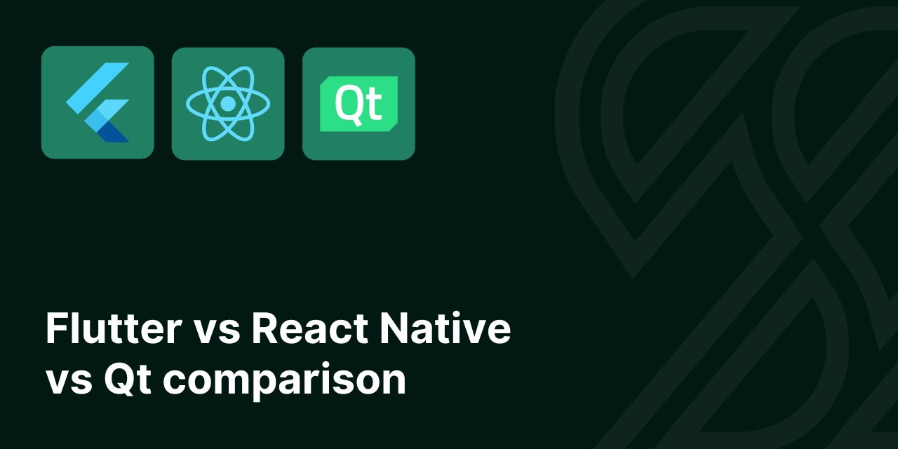

# Flutter vs React Native vs Qt comparison

We allocated some time to do a deep research on the best cross-platform applications development. The result of that was an article that you can find on [Scythe Studio blog](https://scythe-studio.com/en/blog). We will not reveal any conslucions here so do not wait and visit our blog!

---

---

Proper comparison should base on facts. Therefore, we implemented three identical TODO applications in order to give you a feel of every and each framework we compared.
There are also apps used for performance profiling using accurate profiling software GameBench. The results are included in a blog post.

## About Scythe Studio
We’re a team of **Qt and C++ enthusiasts** dedicated to helping businesses build great cross-platform applications. As an official Qt Service Partner, we’ve earned the trust of companies across various industries by delivering high-quality, reliable solutions. With years of experience in **Qt and QML development**, we know how to turn ambitious ideas into outstanding products.

<table style="margin: 0 auto; border:0;">
    <tr style="border:0">
        <td style="border:0">
            
        </td>
        <td style="border:0">
            
        </td>
        <td style="border:0">
            
        </td>
        <td style="border:0">
            
        </td>
    </tr>
</table>

We offer a wide range of services—from brainstorming ideas to delivering polished applications—always tailored to our clients’ needs. By combining deep knowledge of Qt modules and modern technologies with a practical, cost-effective approach, we create solutions that truly make a difference.

## Professional Support
Need help with anything? We’ve got you covered. Our professional support services are here to assist you with. For more details about support options and pricing, just drop us a line at https://scythe-studio.com/en/contact.

## Follow us

Check out those links if you want to see Scythe Studio in action and follow the newest trends saying about Qt Qml development.

* 🌐 [Scythe Studio Website](https://scythe-studio.com/en/)
* ✍️  [Scythe Studio Blog Website](https://scythe-studio.com/en/blog)
* 👔 [Scythe Studio LinkedIn Profile](https://www.linkedin.com/company/scythestudio/mycompany/)
* 👔 [Scythe Studio Facebook Page](https://www.facebook.com/ScytheStudiio)
* 🎥 [Scythe Studio Youtube Channel](https://www.youtube.com/channel/UCf4OHosddUYcfmLuGU9e-SQ/featured)
