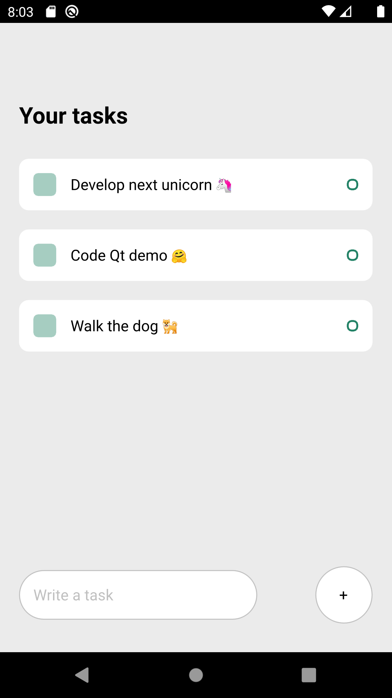

# Flutter vs React Native vs Qt comparison

We allocated some time to do a deep research on the best cross-platform applications development. The result of that was an article that you can find on [Scythe Studio blog](hhttps://scythe-studio.com/en/blog). We will not reveal any conslucions here so do not wait and visit our blog!

---

---

Proper comparison should base on facts. Therefore, we implemented three identical TODO applications in order to give you a feel of every and each framework we compared.
There are also apps used for performance profiling using accurate profiling software GameBench. The results are included in a blog post.

# About Scythe Studio
Zoho Books Forecasting application was developed and is maintained by Scythe Studio company.
We are an official Qt Service Partner and a provider of Qt Software Development services including:
- Desktop applications development
- Mobile applications development
- Embedded systems development
- Qt and C++ consulting
- UI/UX designing

Do not hesitate visting https://scythe-studio.com to discover our capabilities and learn more about Qt Software Development from [Scythe Studio Blog](https://scythe-studio.com/en/blog).